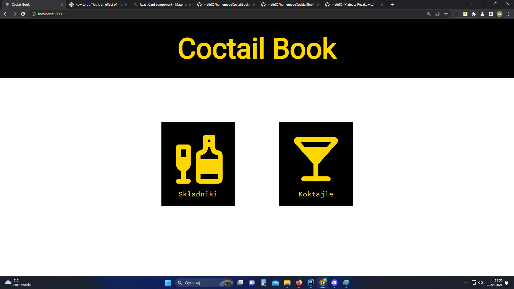
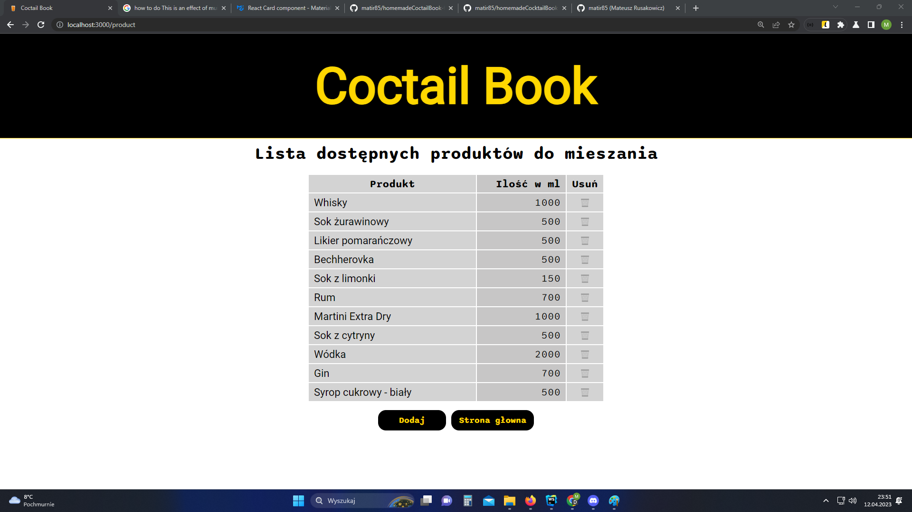
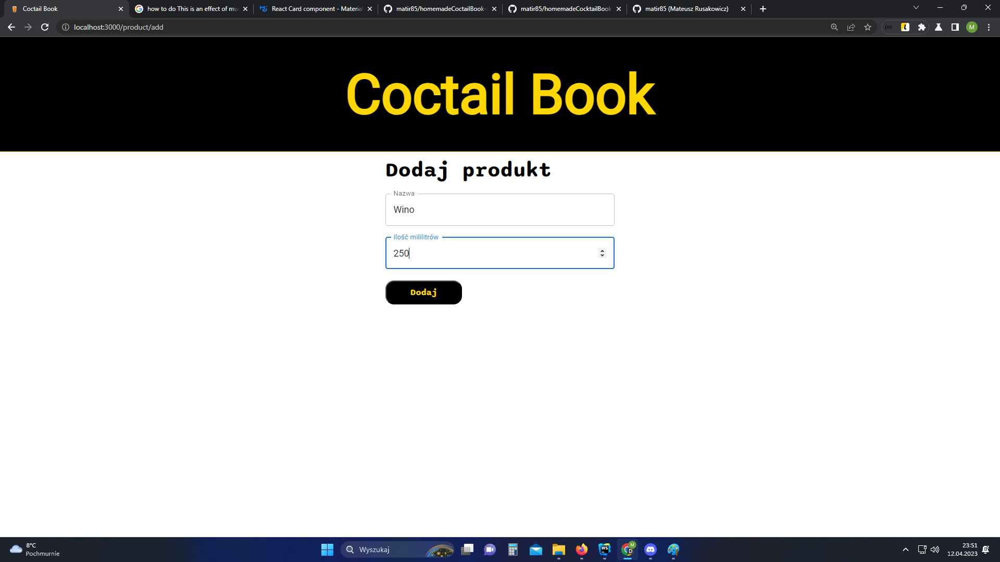
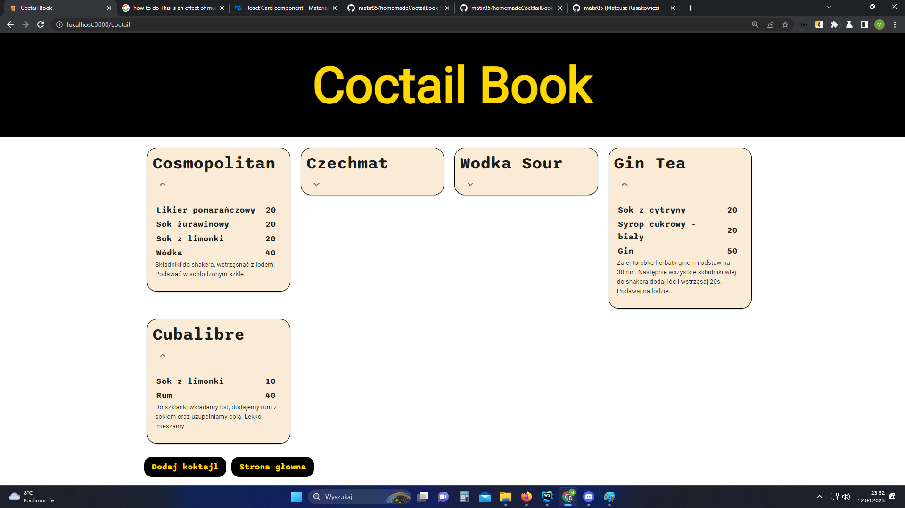
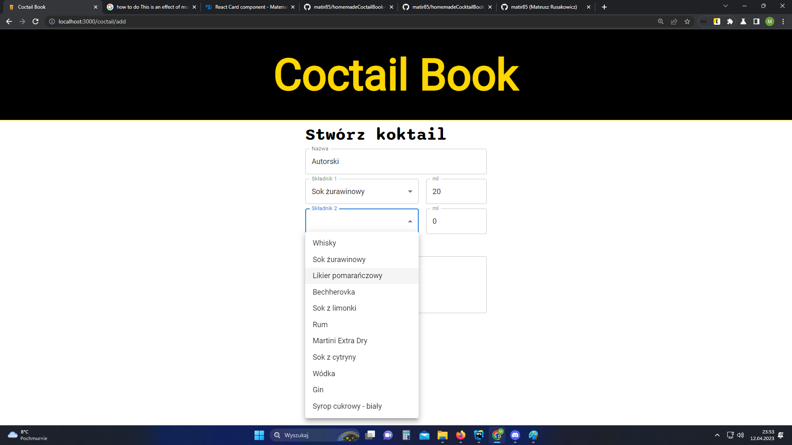
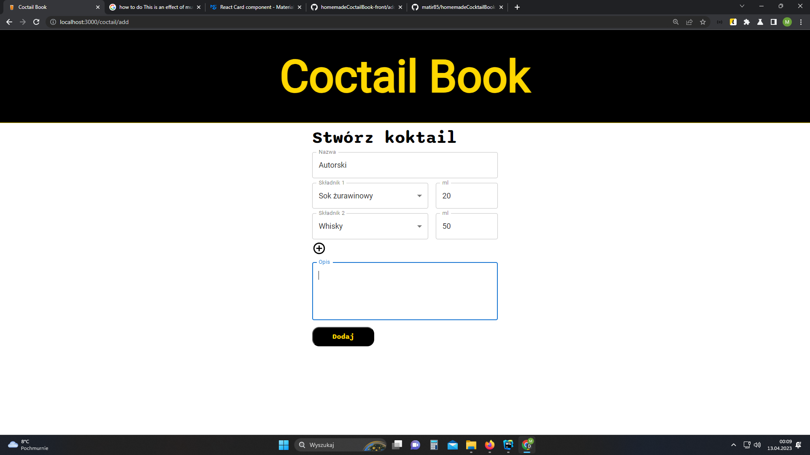

# Projekt na zaliczenie

<p align="center">
  <a href="https://www.megak.pl/" target="_blank" rel="noreferrer"> 
  </a>
</p>

# Front End

Projekt na zaliczenie drugiej edycji [Mega Kursu JavaScriptu MegaK](https://www.megak.pl)

To jest **front end** napisany w ***React***

Do prawidłowego działania, wymagany jest **back end** dostępny pod [tym adresem](https://github.com/matir85/homemadeCocktailBook-back/tree/develop/)


<hr/>

## Opis projektu
Przykład aploikacji do zarządzania domowym barkiem.
- projekt wyglądu (stylowanie)
- lista produktów (pobieranych z bazy danych)
- formularz dodawania produktu
- kadry koktaili (pobieranych z bazy danych)
- formularz tworzenia nowego koktajlu
- urzycie aktualnych technologii oraz trendów:
    - React Hooks
    - React Routing
    - pobieranie danych za pomocą Fetch API
    - REST API (GET, POST, DELETE)
    - asynchroniczna kod (IIFE, async / await)
    - obsługa błędów (try / catch)
    - podział projektu na moduły (wydzielone widoki, komponenty)


<hr/>

## Zastosowane języki i technologie
<p align="center">
  <a href="https://reactjs.org/" target="_blank" rel="noreferrer"> 
  </a> 
</p>
<p align="center">
  <a href="https://www.w3.org/html/" target="_blank" rel="noreferrer">  
  </a> 
  <a href="https://www.w3schools.com/css/" target="_blank" rel="noreferrer">
   
  </a> 
  <a href="https://developer.mozilla.org/en-US/docs/Web/JavaScript" target="_blank" rel="noreferrer"> 
  </a> 
  <a href="https://www.typescriptlang.org/" target="_blank" rel="noreferrer"> 
  </a> 
  <a href="https://git-scm.com/" target="_blank" rel="noreferrer">  
  </a>
  <a href="https://github.com/" target="_blank" rel="noreferrer">  
  </a> 
</p>


<hr/>

## Zadania

- [x] Instalacj Reacta w wersji TypeScript
- [x] Założenie repozytorium na GitHub
- [x] Przygotowanie pliku README
- [x] Konfiguracj Git i wypchniecie projektu na zdlane repozytorium
- [x] Połączenie wspólnych typów FE i BE
- [x] Projekt podziału strony
- [x] Projekt przykładowego nagłówka
- [x] Widoki i Routing
- [x] Projekt widoku podstrony z produktami
- [x] Projekt widoku podstrony z dodawaniem produktów
    - [x] Obsługa dodawania produktów
    - [x] Obsługa usuwania produktów
- [x] Projekt widoku podstrony z koktajlami
- [x] Projekt widoku podstrony z dodawaniem / tworzeniem koktajli
    - [x] Obsługa dodawania koktajli
    - [ ] Obsługa usuwania koktajli
- [ ] Stworzenie Designe z prawdziwego zdarzenia 

<hr/>


## Zrzutu ekranu

### Widok strony głównej
<p>
   
</p>

### Widok listy produktów - poszczególnych składników do mieszania
<p>
   
</p>


### Formularz dodawania produktu
<p>
   
</p>

### Widok listy koktajli
<p>
   
</p>

### Formularz dodawania / tworzenia koktajlu

<p>
   
</p>

<p>
   
</p>

<hr/>


## Uruchomienie

Repozytorium współdziała z częścią back-endową, którą można znaleźć pod [tym adresem](https://github.com/matir85/homemadeCoctailBook-front/tree/develop)

#### Uruchomienie projektu na swojej lokanej maszynie

Sklonuj repozytorium na swój dysk

```bash
git clone https://github.com/matir85/homemadeCoctailBook-front/tree/develop
```

Wejdz do folderu *homemadeCoctailBook-front* i pobierz wymagane zależnosci

```bash
cd homemadeCoctailBook-front
npm install
```

Uruchomienie projektu

```bash
npm start
```

Zostanie uruhomiony serwer [http://localhost:3000](http://localhost:3000) na którym dostępna będzie strona z projektem.
Pamietaj, że pełna funkcjonalność projektu wymaga uruchomienia backendu

Uruchomienie w trybie watch mode

```bash
npm run start:dev
```

Stworzenie wersji produkcyjnej

```bash
npm run start:prod
```

<hr/>

## Kontakt


#### mail: [Gmail](mailto:matir85@gmail.com)

<hr/>
